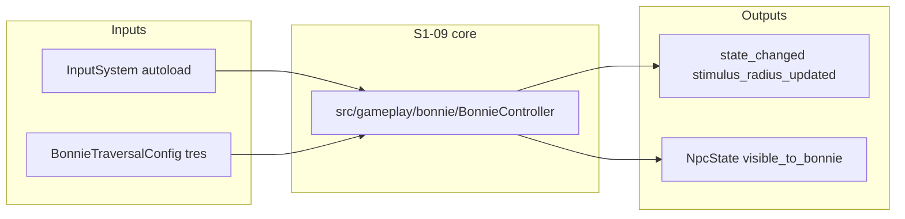

# Session 014 — Polish backlog + S1-09 (handoff program)

**Status — Session 014 closed (2026-04-19):** Branch **`main`** (session-close commit on `git log`). **Primary deliverable shipped:** S1-09 production Bonnie traversal slice (**B1–B5**) in `src/gameplay/bonnie/` + `scenes/gameplay/BonnieController.tscn`. **Track A** remained **default defer** (compost dry-run clean; framebuffer / human semisolid / art re-export not executed this session).

**Track A log (agent):** `mycelium/scripts/compost-workflow.sh --dry-run` → **No stale notes under ..** (2026-04-19). **A1** framebuffer capture deferred (editor-only). **A2** semisolid hand-notes remain **human**. **`res://assets/audio/`** not present in tree yet (optional per `NEXT.md`).

**Read first (in order):**

| # | Path | Why |
|---|------|-----|
| 1 | `NEXT.md` | Immediate priority and Stream B order |
| 2 | `production/sprints/sprint-1.md` | **S1-09** row (Must Have, ~3 sessions, deps S1-04 + S1-08) |
| 3 | `design/gdd/bonnie-traversal.md` | §3.1 states, §3.4 / §4 stimulus table, **AC-T01–AC-T08** (+ AC-T06* family — Session 014 maps sprint to GDD below) |
| 4 | `docs/architecture/ADR-001-production-architecture.md` | Layering, **no `class_name` on production Bonnie**, `run/main_scene`, process order |
| 5 | `prototypes/bonnie-traversal/BonnieController.gd` + `BonnieController.tscn` | **Reference** (prototype owns global `class_name BonnieController`) |
| 6 | `src/gameplay/bonnie/BonnieController.gd` | **Production** implementation |
| 7 | `assets/data/bonnie_traversal_config.tres` + `BonnieTraversalConfig.gd` | **All numeric tuning** — no raw literals in gameplay `.gd` (S1-08) |
| 8 | `SESSION-013-PROMPT.md` | Session 013 closure + optional polish pointers |
| 9 | `prototypes/bonnie-traversal/PLAYTEST-004.md` | Optional polish table; **do not check off S1-18** until S1-17+ (A5) |

## Sprint S1-09 ↔ GDD mapping

| Sprint acceptance | GDD anchor |
|--------------------|------------|
| 13 `BonnieState` values | `src/shared/enums.gd` + `bonnie-traversal.md` §3.1 |
| Signals `state_changed`, `stimulus_radius_updated` | §3.1 / reactive NPC seam (§6 Systems 9) |
| `visible_to_bonnie` on `NpcState` | §3.4 stimulus table + §6 (NPC reads stimulus) |
| AC-T01–AC-T08 | `bonnie-traversal.md` acceptance § (lines ~758+) |

## Locked / out of scope (Session 014 unless producer expands)

- **S1-10+** camera production hookup beyond any local constants table stub.
- **Prototype archive** to `prototypes/archived/` — **only after** full AC validation (sprint row).
- **S1-18** full core-loop playtest checklist line — **leave unchecked** in `PLAYTEST-004.md` until S1-17+.
- **Chaos meter** full loop, **`run/main_scene`** switch to production apartment (ADR: stays prototype `TestLevel.tscn` until S1-17).

## Track A — Session 013 optional polish (parallel / default defer)

| ID | Work | Owner | Agent-automatable? | Session 014 disposition |
|----|------|-------|----------------------|-------------------------|
| A1 | Framebuffer verification — `tools/capture_verification_013.gd` **without** `--headless`; compare `verification-013/*.png` | Dev / QA | Partial | **Deferred** — requires human editor run; composites remain canonical per Session 013 |
| A2 | Human semisolid feel (apex hop, edge pops, margins) — `PLAYTEST-004` Finding 2 | Human playtester | No | **Human** — bullets in `PLAYTEST-004.md` or `PLAYTEST-004-handnotes.md` when run |
| A3 | Round 3 art / MCP — re-exports, soft-landing reads | Art + agent | Partial | **Deferred** until new pixels land; then `IMPORT-GODOT.md` §3–§4 |
| A4 | Phase A re-stat | Agent | When A3 triggers | **N/A** until locomotion PNG/JSON changes |
| A5 | PLAYTEST S1-18 line | Sprint / QA | N/A | **Do not check off** until S1-17+ |
| A6 | Doc / hygiene — GUT counts, compost dry-run, optional `res://assets/audio/` | Agent + dev | Mostly | **Compost dry-run** recorded in closure; optional audio per `NEXT.md` |

**Orchestration:** Default **defer Track A**; pick up A2/A3 only if producer prioritizes feel or art before traversal code.

## Track B — S1-09 production Bonnie traversal (essential)

**Goal:** Production `BonnieController` satisfies sprint **S1-09** slice: enum-driven **13 states**, tuning **only** from `bonnie_traversal_config.tres`, **`state_changed`**, **`stimulus_radius_updated`**, **`visible_to_bonnie`** owned by **`LevelManager`** LOS pass (**Session 015 — A+C**: in-radius **and** line-of-sight; see **`SESSION-015-PROMPT.md`**). Bonnie notifies invalidation and exposes LOS rig positions only.

### Phase B1 — Contract + scene shell

- Production `CharacterBody2D` scene: `scenes/gameplay/BonnieController.tscn` → script `res://src/gameplay/bonnie/BonnieController.gd`.
- Preload or `@export var traversal_config`; default load `res://assets/data/bonnie_traversal_config.tres` if unset.
- Wire `InputSystem.get_move_vector()` + `Input` for `run` / `jump` / `sneak`.
- **No `class_name`** on production script (ADR-001).
- GUT smoke: instance runs `_physics_process` without error when config assigned.

### Phase B2 — State machine spine

- All **13** `BonnieState` values reachable in code paths (some transitions stubbed to simpler ground/air until later sessions).
- Emit **`state_changed(old, new)`** on every transition.
- Speeds / gravity / stimulus radii read **only** from `BonnieTraversalConfig`.

### Phase B3 — Movement fidelity (Session 014 priority subset)

**In scope for this session (aligns sprint AC-T01–T08 emphasis without full AC-T06* ladder):**

| Priority | AC | Intent |
|----------|-----|--------|
| P0 | AC-T01 | Frame-accurate read of move + actions in `_physics_process` |
| P0 | AC-T06b | Run is a **dedicated button** — walk does not auto-run |
| P1 | AC-T02 | Sneak cap vs walk vs run caps from config |
| P1 | AC-T03 | Slide when speed > `slide_trigger_speed` + opposing horizontal intent |
| P1 | AC-T04 | Tap vs hold jump height (`hop_velocity` / `jump_velocity`) |
| P1 | AC-T05 | Landing / skid feel from horizontal speed at touch (simplified skid window) |
| P2 | AC-T06 | Rough landing when vertical fall distance ≥ `rough_landing_threshold` |
| P2 | AC-T07 | Lower stimulus radii in SNEAKING vs WALKING vs RUNNING (from `.tres`) |

**Explicit follow-up (not required for Session 014 closure):** AC-T06c / c2 / d / e / f (ledge parry, double jump combo, wall jump, claw brake), AC-T08 (camera — S1-10).

### Phase B4 — Stimulus radius + NPC visibility

- Implement **`stimulus_radius_updated(radius: float)`** whenever effective radius changes (state-driven per GDD §3.4: SLIDING = run radius + slide bonus).
- **`LevelManager`** LOS pass (**Session 015 — A+C**): distance to registered NPC root **and** line-of-sight (high-primary ray to chest); updates **`VisibilityLedger`** and syncs **`NpcState.visible_to_bonnie`**. **`BonnieController`** notifies invalidation + exposes LOS rig API only — it does **not** own the per-NPC visibility loop. See **`SESSION-015-PROMPT.md`**.
- Ambiguous rules → **`CLAUDE.md`**: question → options → decision.

### Phase B5 — Verification

- Shell-only gdcli: `npx -y gdcli-godot doctor` and `npx -y gdcli-godot script lint` on touched `.gd` files (see `.claude/skills/godot-mcp/SKILL.md`).
- GUT: `godot --headless --path . -s res://addons/gut/gut_cmdln.gd -- -gdir=res://tests/unit -gexit` (or project’s standard wrapper).
- Optional: headless boot of production scene if/when a dedicated boot test exists (`boot_test_level_once` pattern — **not** required to replace `run/main_scene`).

## Cross-cutting constraints

- **No `class_name`** on production `BonnieController.gd` (prototype collision — ADR-001).
- **gdcli** via **`npx -y gdcli-godot`** (shell), not MCP CallMcpTool.
- **Mycelium:** `mycelium.sh note HEAD -k context` on reviewed commits; `mycelium/scripts/compost-workflow.sh --dry-run` when stale note count rises.
- **Collaboration:** `CLAUDE.md` for ambiguous traversal or visibility rules.

## Deliverables checklist (session closure)

- [x] `SESSION-014-PROMPT.md` status block updated to **closed** (date **2026-04-19**).
- [x] `CHANGELOG.md` / `DEVLOG.md` bullets for S1-09 slice + Track A disposition.
- [ ] `PLAYTEST-004.md` updated only if human ran A2 or verification changed (not required this session).
- [x] Green **gdcli** + **GUT** on touched paths (`godot --headless` GUT `res://tests/unit`; `npx -y gdcli-godot doctor`; `gdcli script lint --file` on touched `.gd`).

## Risks

- **`class_name` collision** if production script accidentally declares `BonnieController` while prototype is active.
- **Editor drift:** `project.godot` stretch / `default_texture_filter` — re-apply per `ViewportConfig` / `NEXT.md` if stripped.

## Success criteria (meta)

- This file is **self-contained** for a new agent.
- Track B lands at least **one mergeable vertical slice** (**B1+B2** minimum) with green GUT + gdcli; **B3–B5** per implementation session.
- Track A items are **done**, **documented deferred**, or **assigned human** — no false “complete” claims.

## Next session

- **`SESSION-015-PROMPT.md`** — **A+C** visibility (distance + LOS), `VisibilityLedger`, LevelManager LOS pass; consumer inventory; §10 cutover after inventory.
